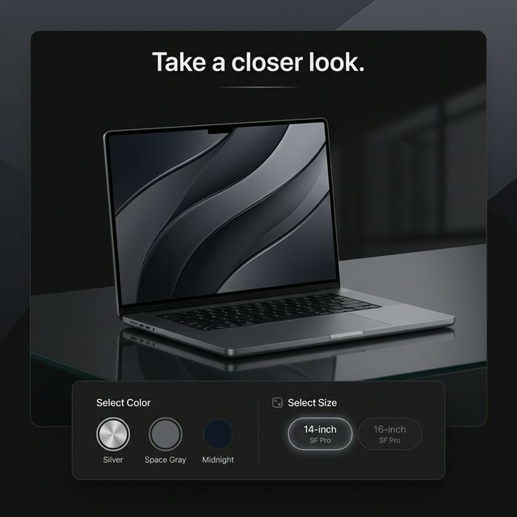

# Macbook Landing Page


An immersive Apple-style 3D product showcase built with modern web technologies. This project features scroll-driven animations and a cinematic interactive 3D product view.



## ✨ Featuresp
- **Immersive 3D visuals** powered by Three.js
- **Scroll-triggered animations** orchestrated by GSAP
- **Responsive design** customized with TailwindCSS
- **Dynamic UI component architecture** built using React

## ⚙️ Tech Stack

- **React.js**
- **Three.js** (@react-three/fiber, @react-three/drei)
- **GSAP & ScrollTrigger**
- **TailwindCSS**
- **Zustand**
- **Vite**

## 🤸 Quick Start

### Installation

Ensure you have Node.js installed, then install the dependencies:

```bash
npm install
```

### Run Locally

Start the Vite development server:

```bash
npm run dev
```

Visit the local URL shown in your terminal (e.g., `http://localhost:5173`) to view the landing page.

---

**Made by Anshu Shee**
